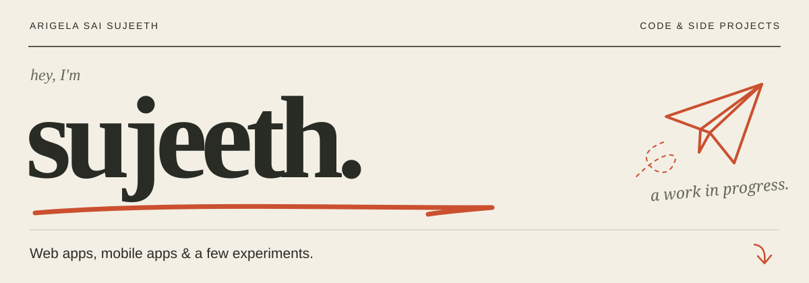

  

  <a href="https://github.com/Sujeeth-Sai?tab=repositories"><b>Explore my work ↗</b></a>
  &nbsp;&nbsp; / &nbsp;&nbsp;
  <a href="https://www.linkedin.com/in/sai-sujeeth-0b6b21380/">LinkedIn</a>
  &nbsp;&nbsp; / &nbsp;&nbsp;
  <a href="mailto:sujeetharigela14@gmail.com">Let's talk</a>

### 01 / The builder

I'm **Arigela Sai Sujeeth**. I build across **AI, web, mobile, and on-chain systems** — from connecting scattered research to exploring fairer event ticketing. I like projects where the code has a clear reason to exist.

### 02 / Selected work

<table>
<tr>
<td width="50%" valign="top">

**01 · THREAD AI**

#### Give scattered research a memory.

Capture information from the web, connect sources, detect contradictions and gaps, and generate structured research reports.

`AI research` `Knowledge connections` `TypeScript`

[Explore THREAD →](https://github.com/Sujeeth-Sai/Thread-AI)

</td>
<td width="50%" valign="top">

**02 · FAIRTICKET**

#### Put fairness into the ticket.

A Monad testnet ticketing prototype exploring smart-contract resale caps and wallet-based ownership to tackle ticket scalping.

`Monad` `Smart contracts` `TypeScript`

[Explore FairTicket →](https://github.com/Sujeeth-Sai/Fair-Ticket-Monad)

</td>
</tr>
<tr>
<td width="50%" valign="top">

**03 · SRI MALLIKARJUNA / WEB**

#### From an idea to the browser.

A TypeScript web project with a companion mobile repository.

`Web development` `TypeScript`

[Explore the web project →](https://github.com/Sujeeth-Sai/Sri_Mallikarjuna_Webiste)

</td>
<td width="50%" valign="top">

**04 · SRI MALLIKARJUNA / APP**

#### Take the experience mobile.

The Kotlin mobile project in the Sri Mallikarjuna collection.

`Mobile development` `Kotlin`

[Explore the app →](https://github.com/Sujeeth-Sai/Sri_Mallikarjuna_App)

</td>
</tr>
</table>

### 03 / My workbench

**Languages** &nbsp; `TypeScript` `Kotlin` `Solidity`
 
**Exploring** &nbsp; `AI-assisted research` `Web experiences` `Mobile apps` `On-chain rules`

---

<b>Have an interesting problem? Let's build something useful.</b>  
<a href="mailto:sujeetharigela14@gmail.com">Start a conversation ↗</a>

Explore. Build. Iterate.

